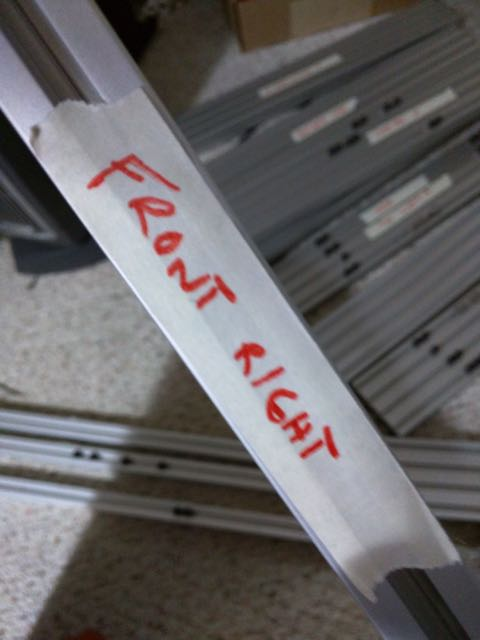
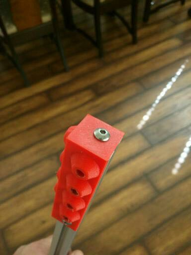
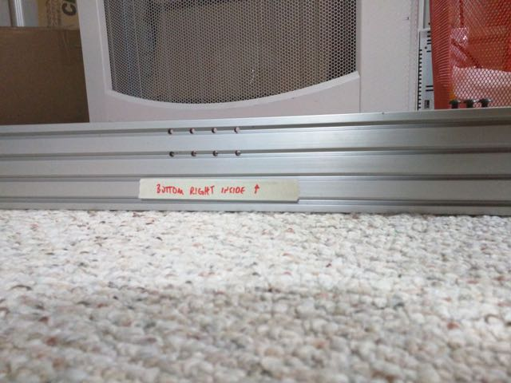
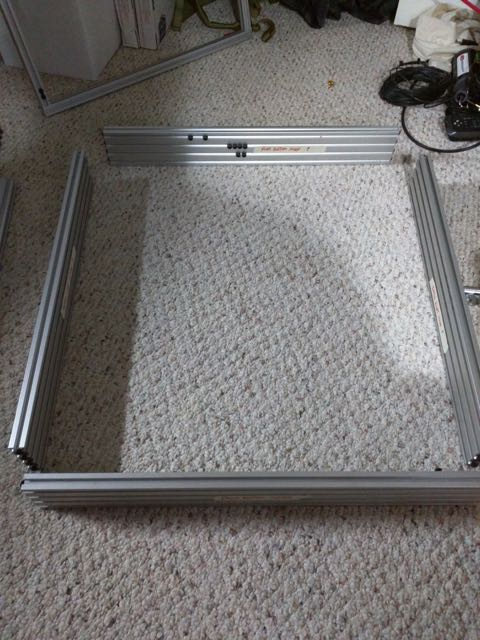
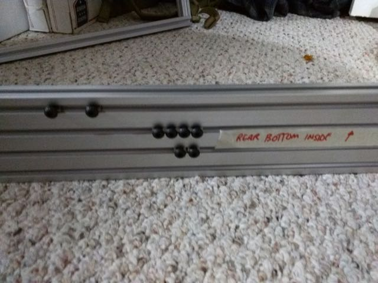
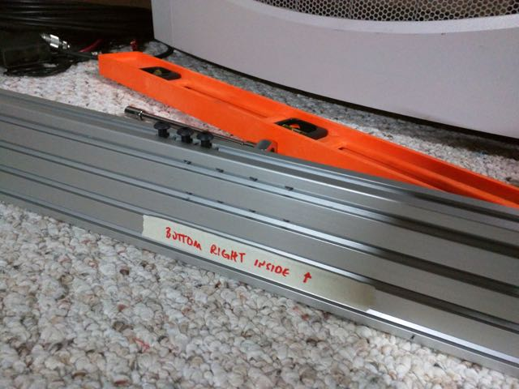
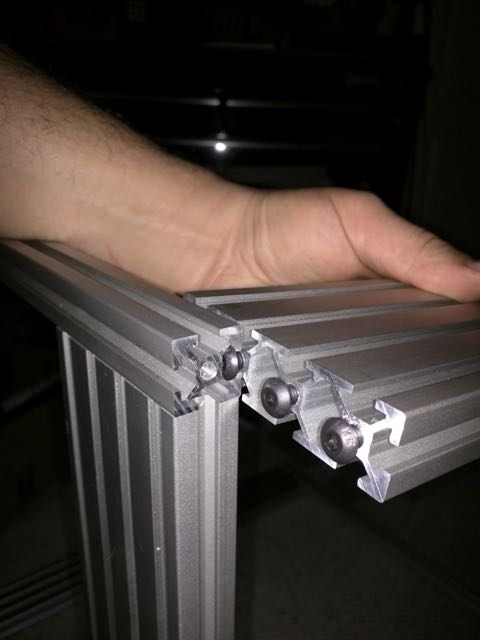

Herculien Build Guide
=====================

This guide is intended to get you through the basics of assembling the Herculien
3D Printer.  It is a living document so be aware that the procedure is subject to change.

Pictures are included for clarity and where necessary YouTube videos will be embedded.

The guide will be structured around the subassemblies that are listed in the BOM however
to save time later we will include parts/fasteners from other subassemblies where
needed.

Tools Required
==============

 * 2.5mm Hex Wrench
 * 3mm Hex Wrench
 * Bubble Level (for leveling the Z Gantry)
 * Multimeter
 * Saw for cutting aluminum
 * Marker
 * Masking tape
 * Metric tap set (only a 5mm tap is required)
 * Drill
 * 2mm drill bit
 * 5mm drill bit
 * 8mm drill bit
 * 7/8" drill bit
 * 1/2" End mill
 
Metal Preparation
=================

 1. Using the 5mm x .8 thread tap, tap all of the regular 20x80 extrusion end holes
    * Use cutting oil
    * Go Slow
    * You can either do by hand or using a drill.  If you use a drill you must take it VERY slow as you can easily break the tap bit.
 
    Example:
    

Main Frame
==========

## Parts required:

 * 9x 20x80 Aluminum Extrusions cut to 569.5mm
 * 4x 20x20 Aluminum Extrusions cut to 609.5mm
 * 2x 20x80 V-Slot Aluminum Extrusions
 * 102x T-Slot Nuts
 * 160x M5 x 10mm Button Head Screws
 * 6x M5 x 8mm Flat Head Socket Cap Screws
 * 16x M5 x 8mm Button Head Screws

## Prep

 1. The BOM lists a 1 meter section of V-Slot, if you haven't cut the V-Slot you should do that now.
    * To cut the V-Slot you can use any saw or cutting wheel capable of cutting through a 20x80 extrusion.
    * I was successful doing this with an angle grinder and metal cutoff blade.
    * While you should be careful to cut this as straight as possible it isn't necessary to
      cut this exactly straight.  The factory cut ends are straight and those will be what is used
      to square the verticals for the Z Gantry rails to be perpendicular to the center rail.
    
 2. Using your marker and masking tape, label each of the 9 20x80 extrusions using the following labels.  These labels aren't necessary
    but will make things easier in the following steps to keep things in order.  It also helps to indicate which end it up, I use arrows
    on the masking labels.
    
    * Top Front
    * Top Rear
    * Top Right
    * Top Left
    * Bottom Front
    * Bottom Rear
    * Bottom Right
    * Bottom Left
    * Center Rail
    
    Example:
    

 3. Using your marker and masking tape, label each of the 4 20x20 extrusions with the following labels.
    * Front Right
    * Rear Right
    * Front Left
    * Rear Left
    
    Example:
    
  
 4. Locate the 4 20x20 extrusions to be used at vertical supports for the main frame.
  
 5. Using 3 M5x8mm button head screws and 2 T-Slot nuts attach the 20x20 extrusion drill guide to one end of the extrusion.
  
     Examples: 
               
  
 6. Using the 5mm drill bit, drill all 8 holes using the raised drill guide holes.
     
     Result: 
  
 7. Repeat this process for the other end of the extrusion and then for the remaining 3 verticals.
  
 8.  Locate the two 20x80 extrusions marked "Bottom Right" and "Bottom Left"
  
 9.  Beginning with one of these, use 4 M5x8mm button head screws and 4 T-Slot nuts attach the 20x80 8 hole drill guide but do not tighten down.
  
 10. Measure from one end of the extrusion 215mm and slide the drill guide over until the very edge of it lines up with that line.
      
      Drawing: 
      
 11. Tighten the drill guide down and double check your measurement until it is **EXACT**
  
 12. Drill all 8 holes using the 5mm drill bit.
  
 13. Repeat for the other piece making sure your measurements are **EXACT**
  
 14. Orient the two pieces standing on their 20mm side on the floor or other flat surface keeping the perspective that you are looking at the completed chassis from the front.  e.g. "Bottom Left" goes to your left and "Bottom right" goes to your right.
  
 15. Ensure the 2 rows of holes you just drilled are nearest the top of the extrusion and the side measured 215mm from edge to the drill guide is placed facing you.
  
 16. Now using the masking tape and markers label the inside face of each so that the orientation is clear.
      
      Result: 
              
              
   
 17. Locate the 20x80 extrusion pieces marked "Bottom Front" and "Bottom Rear"
 
 18. Orient the pieces on the floor or flat surface with the 2 bottom left and right extrusions with one 20mm side lying flat on the surface.
 
     Example: 
 
 19. Using the marker and masking tape, label the inside of each and use an drawn arrow to indicate which way is up.
 
 20. On the piece marked "Bottom Rear" insert 2 T-Slot nuts in the top row of the innermost side.  Insert 4 T-Slot nuts in the row below that.  Insert 2 T-Slot nuts in the row below that.  Use M5x10mm button head screws hand tightened to hold them in place.
 
     Example: 

 21. On the piece marked "Bottom Front" insert 1 T-Slot nut on the top row of the innermost side.  Insert 1 T-Slot nut in the row below that.  Use M5x10mm button head screws, hand tightened, to hole them in place.
 
     Example: 
 
 22. On the piece marked "Bottom Right" insert 3 T-Slot nuts on the top row and use M5x10mm button top screws, hand tightened, to hold them in place.
     
     Example: 
 
 23. Thread M5x10mm button head screws into each of the 4 holes on each end of the 4 bottom 20x80mm extrusions placed on the flat surface from earlier.  Thread the screws in until there is only approximately 3-4mm of thread showing.
 
     Example: 
 
 24. Locate the 20x80 extrusion labeled "Center Rail"
 
 25. Thread M5x10mm button head screws in the 4 holes in each of the ends of the "Center Rail" leaving only about 3-4mm of thread showing.
 
 26. Slide one side of the center rails button head screws in the bottom left 20x80 extrusion's second from the top slot and visually line it up with the 4 holes that are drilled in the bottom left piece.
 
 27. Using your measuring tool measure 215mm from the front edge of the "Bottom Left" 20x80mm extrusion to the edge of the "Center Rail".
 
 28. Passing the 2.5mm hex wrench through the holes in the opposite side of the "Front Left" extrusion tighten the button head screws on the "Center Rail" locking them in place.  Be sure to double check your measurements.
 
 29. The Front of the Center rail is now the side measured 215mm away from the front edge of the supporting extrusion.  If it helps you to keep track of these things use the masking tape and marker to label the side that is front.
 
 30. On the front side of the center rail insert 2 T-Slot nuts and use 2 M5x10mm button head screws, hand tightened, to hold them in place. On the top of the "Center Rail" in the first of four slots insert 4 T-Slot nuts with M5x10mm button head screws to hold them in place.  Do the same for the second from the front edge slot.  Skip the third slot and on the foourth slot from the front insert 2 T-Slot Nuts with 2 M5x10mm button head screws to hole them in place.
 
 31. Now repeat step 26-28 for the other side of the Center Rail, securing the Center Rail to the "Bottom Right" 20x80mm extrusion.
 
 24. Locate the 4 20x20 extrusions that are 609.5mm long.  These are the verticals to hold everything upright.
 
 25. Find the 20x80 extrusions marked "Bottom Front" and "Bottom Left" and use the 20x20 vertical marked "Front Left" for the next step.
 
 26. Slide button head screws at the end of the "Bottom Front" 20x80 extrusion's left side into the slot of the 20x20mm extrusion and then do the same with the 20x80mm "Bottom Left" extrusion at a right angle to the "Bottom Front" extrusion.  See picture for example.
     
     Example: 
 
 27. Use your 2.5mm hex wrench to tighten the button head screws by passing the wrench through the holes drilled in the 20x20 extrusion.  **ENSURE** the bottom of the 20x80 extrusions are flush with the bottom of the vertical 20x20 extrusion.
 
 28. Repeat steps 25-27 for the 4 corners paying close attention to use the correct vertical per corner.  If you use the wrong one, you can switch their labels once you're finished.  The labeling matters in the coming steps.
 
 